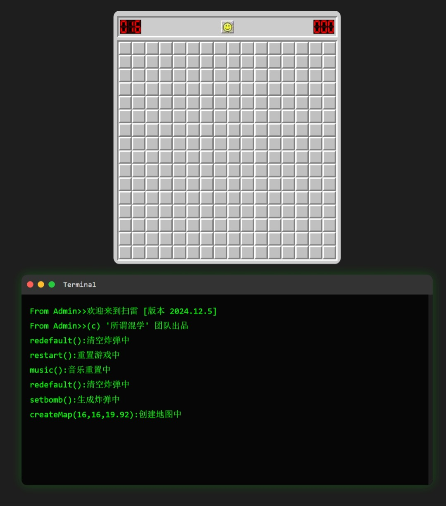
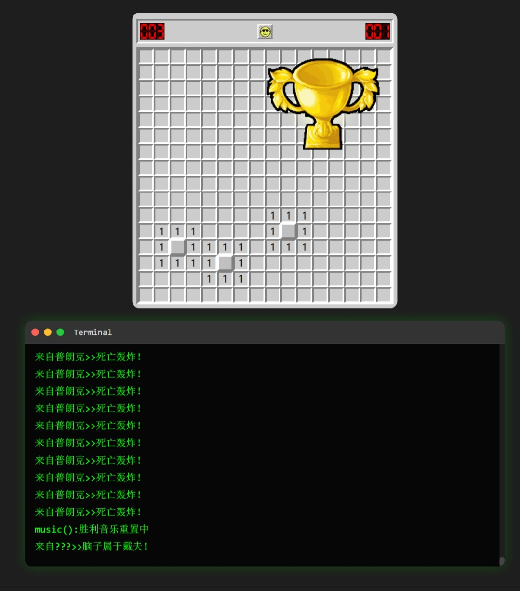
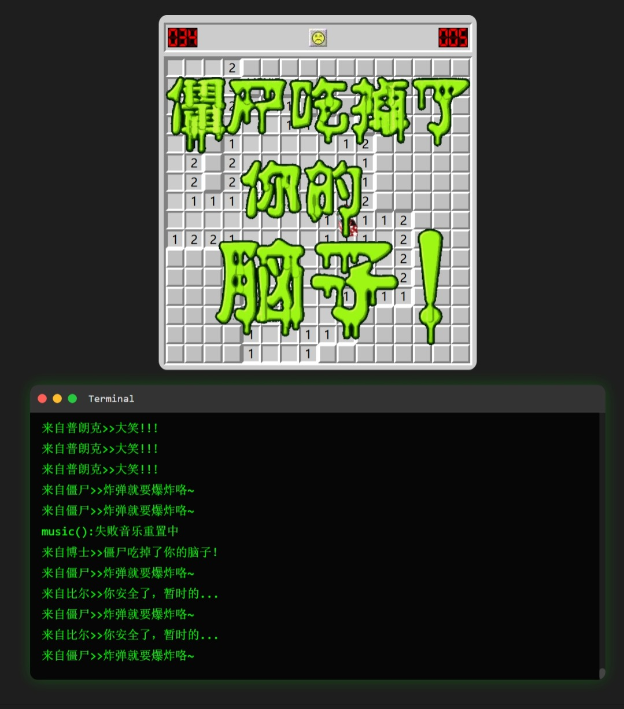
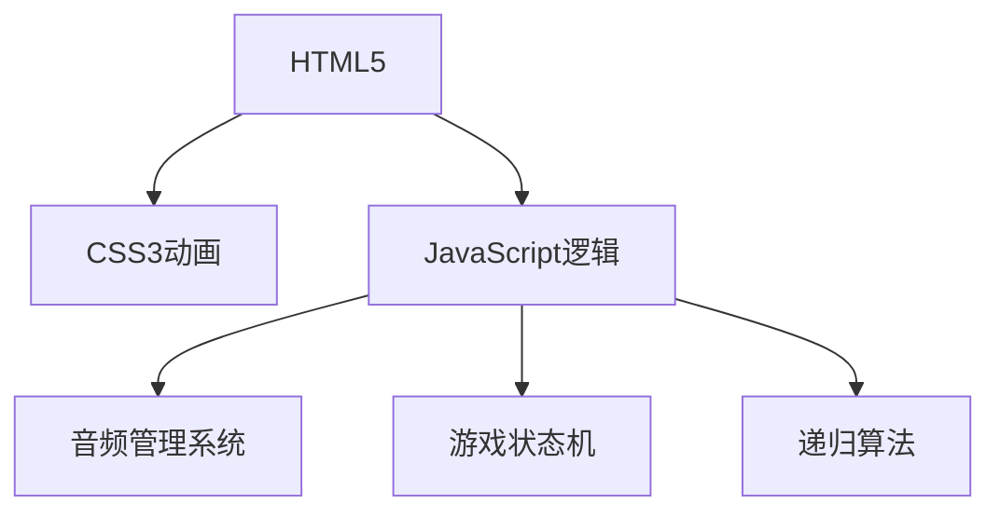

# 🎮 Mine Clearance - 创意扫雷游戏

[](https://opensource.org/licenses/MIT) [](https://developer.mozilla.org) [](https://developer.mozilla.org) [](https://developer.mozilla.org)


*图1：游戏主界面展示*

## 🚀 快速开始

```bash
git clone https://github.com/JGG0sbp66/mine_clearance.git
双击 main.html 即可运行
```

## 🌈 项目特色

### 经典玩法革新

- 💣 **PVZ主题元素** - 地雷变为"小丑盒"，胜利条件是"清除所有小丑盒"
- 🎭 **多游戏彩蛋** - 融合英雄联盟、求生之路等经典游戏元素
- 🎵 **沉浸式音效** - 包含9种不同情境音效和背景音乐


*图2：胜利画面展示*

*图3：失败画面展示*

## 🎯 游戏规则

| 元素 | 说明 |
|------|------|
| 🃏 小丑盒 | 相当于传统扫雷中的地雷 |
| 🧠 大脑 | 需要保护的终极目标 |
| 💀 僵尸 | 失败时出现的惩罚动画 |
| 🏆 奖杯 | 胜利后获得的奖励 |

## 🛠️ 技术架构



## 🙏 致谢

特别感谢我的高中信息技术老师  

## 📌 项目地址

👉 [GitHub仓库](https://github.com/JGG0sbp66/mine_clearance)
